# Half-Life 2: Versus

An extraction shooter gamemode for Garry's Mod where players explore, fight, loot and grow stronger in the world of Half-Life 2.

## Useful Links

[&raquo; 🏗 Guide to Setting up a Dev Server](docs/dev-server-guide.md)

[&raquo; 🗺️ Creating a Map Overview](docs/creating-a-map-overview.md)

## What's it like to play?

### Contracts

The main gameplay loop revolves around taking contracts, completing objectives, and extracting. Find loot, fight Combine, and survive until extraction.

<video src="web/landing/src/public/in-game/contract_mode.mp4" controls muted title="Contract mode gameplay"></video>

### Endurance Mode

Not every session has to be a contract run. Queue up with 2-4 players and fight endless waves of zombies for experience and loot in Endurance mode. It brings some variation from contracts, and gives a way to play co-op.

### Inventory Management

Dragging and dropping makes inventory management a breeze. Drop unwanted loot and equip new gear on the fly as you adapt to changing situations in the field.

<video src="web/landing/src/public/in-game/inventory.mp4" controls muted title="Inventory drag and drop"></video>

### Items, Rarity & the Auction House

Items have different rarities, which affects their damage output, so it's worth buying and selling legendary items in the auction house.

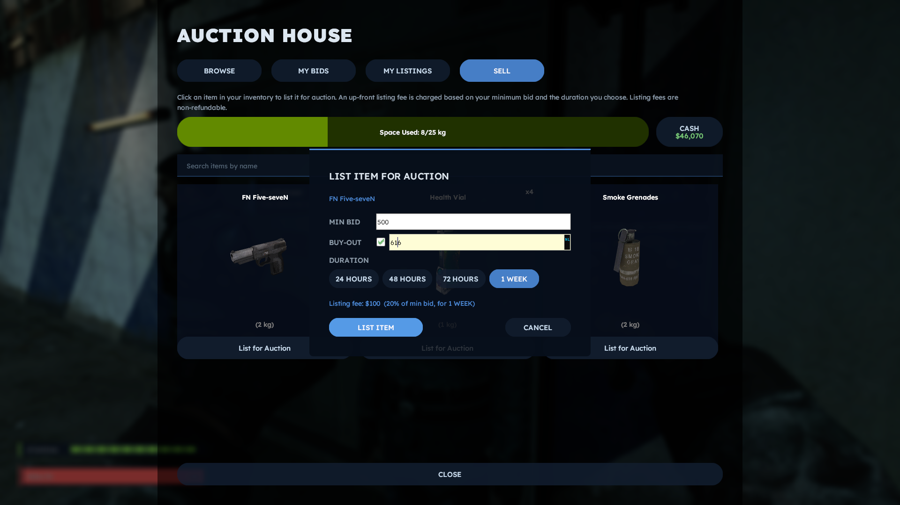

### Contracts & Bounties

You can pick up bounties and go perform contracts to earn some extra cash.

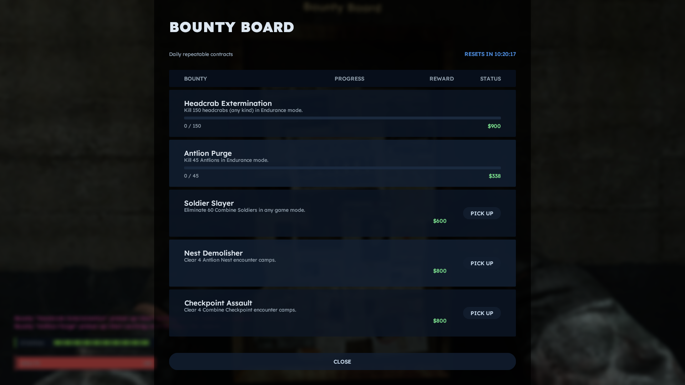

## The Hideout

The Hideout is a non-combat social hub server where you gear up, spend your earnings, and relax between contracts.

### Armoury

The Armoury NPC can help you out if you need to stock up on weapons, grenades or basic gear. Here's some of the items you can buy from the Armoury.

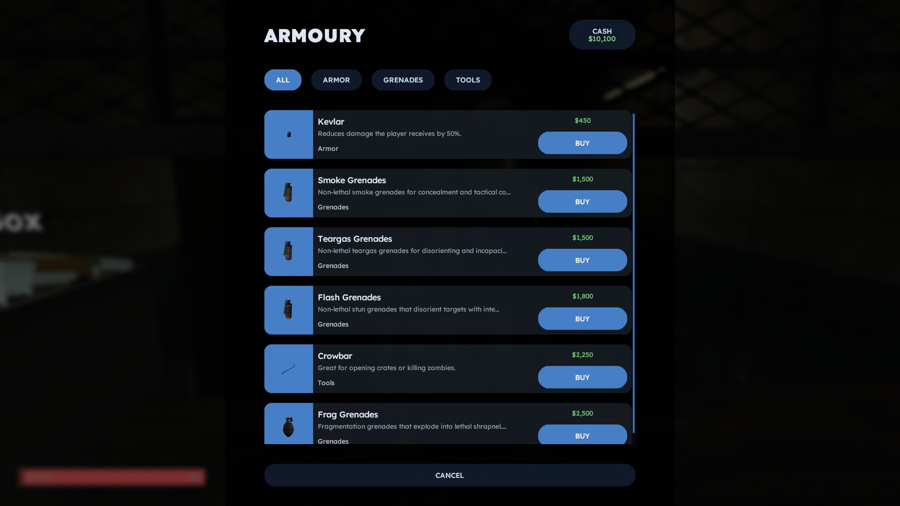

### Quartermaster

The Quartermaster will provide new players with a starter kit to help them get going. Here's the Quartermaster's menu, just after claiming the starter kit.

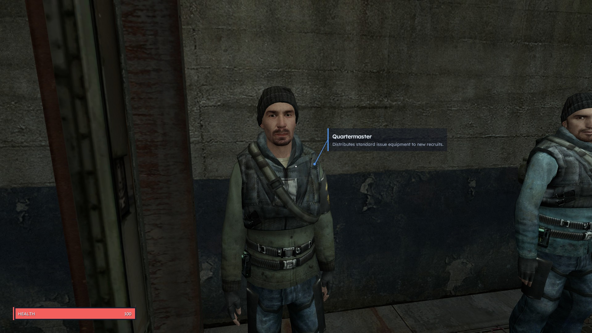

### Scrapper

Any items you don't need can be sold to the Scrapper for a fraction of their value. It's a good way to offload junk you don't want cluttering your inventory.

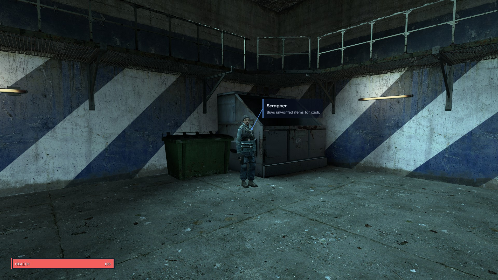

### Medics

These medics can help you stay alive in the field. Buy health items, or get decontaminated if you've been exposed to radiation.

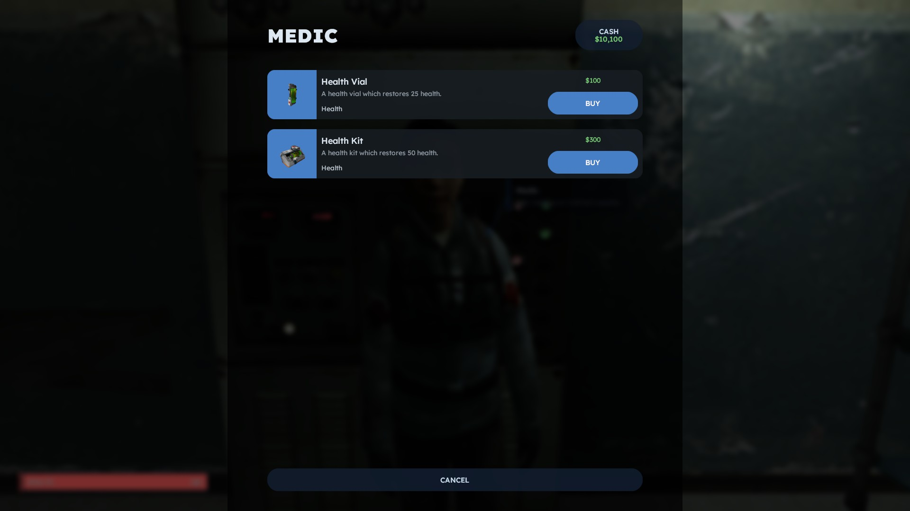

### Decontaminator

Some high-value contract maps are irradiated, meaning you can only stay in them for a limited time. The Decontaminator NPC can remove radiation for a fee.

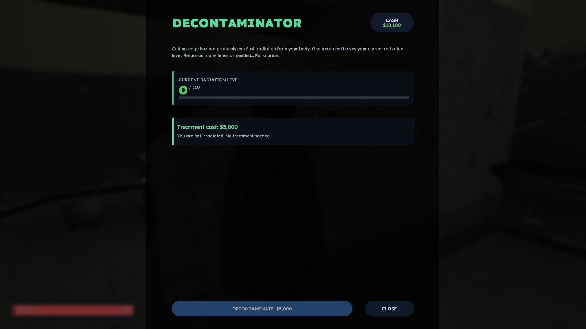

### Vortigaunt Weapon Upgrades

This Vortigaunt can use its powers to upgrade the effectiveness of your weapon.

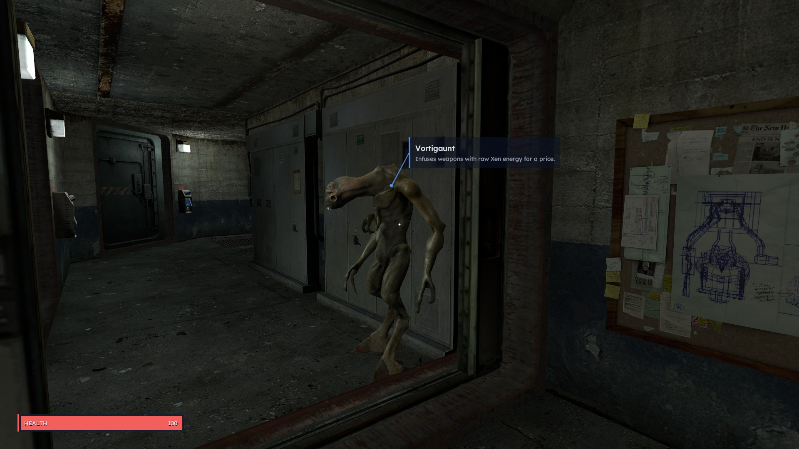

### Player Housing

Kick back in your player housing between contracts. It's a safe haven where you can access your stash and decorate your space using materials you've found in the field. Inside your player housing, you'll find a chest that serves as your personal stash, where you can store valuable loot to keep it safe between contracts.

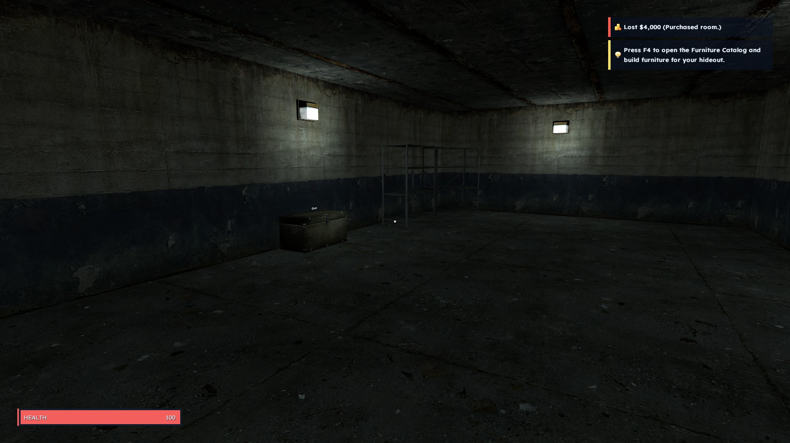

### Character Customization

Customize your character's appearance.

<video src="web/landing/src/public/in-game/character.mp4" controls muted title="Character customization"></video>

### Leaderboard

The leaderboard in the Hideout can be interacted with to view the current rankings and your own stats.

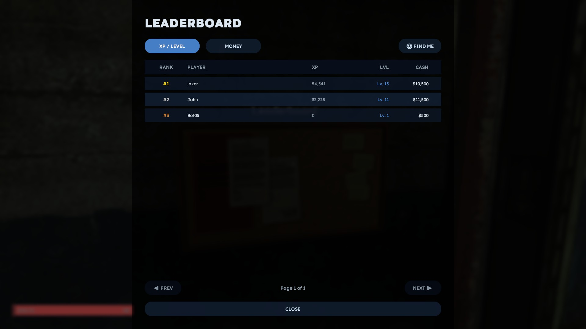

### Smuggler Network

If you feel like letting others work for you, the Smuggler Network is the place to be. Set NPCs on smuggling runs, and earn a cut of the profits. It's a great way to make some extra cash on the side.

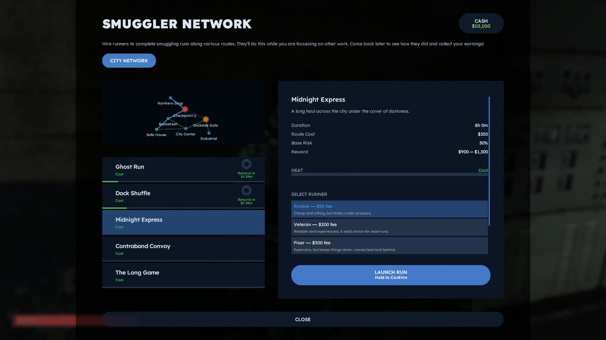
