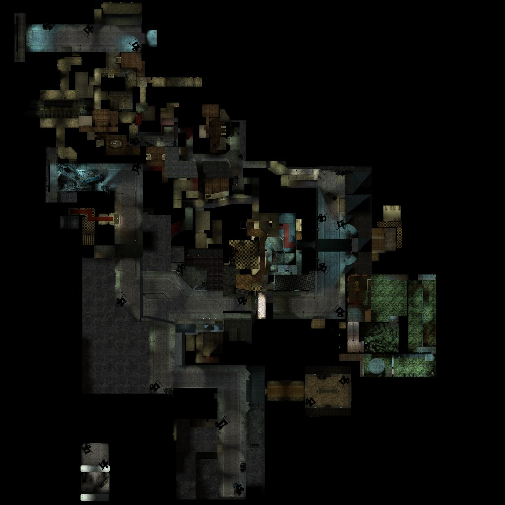

# 🗺️ Creating Map Overview Screenshots for Garry's Mod



## Quick Guide

To create an accurate map overview screenshot that works correctly with the coordinate conversion system, follow these exact steps:

### 1. Set Up the Game

```txt
mat_setvideomode 1280 1024 1
sv_cheats 1
```

**Important:** Use windowed mode (`1` at the end) to avoid DPI scaling issues that occur in fullscreen.

Although 1024x1024 is ideal, Garry's Mod may refuse it. 1280x1024 works fine; you'll just need to crop the screenshot later.

### 2. Prepare the View

Go into noclip near the center of your map:

```txt
sv_cheats 1
noclip
```

Remove visual clutter:

```txt
r_skybox 0
fog_override 1
fog_enable 0
r_drawstaticprops 0
```

### 3. Position the Overview

Use these commands to set up the overview view, which will position you above the map:

```txt
cl_leveloverviewmarker 1024
cl_leveloverview 12
```

- `cl_leveloverviewmarker 1024` draws a 1024x1024 square showing the screenshot area
- `cl_leveloverview 12` sets the scale (adjust until the map fits in the square)
- Use arrow keys to move the view, note that you are noclipping around the map during this time.
- The console will print: `Overview: scale X.XX, pos_x XXXX, pos_y XXXX` each time you move.

### 4. Take the Screenshot

```txt
cl_drawhud 0
bind F12 "screenshot"
```

Press F12 to take a screenshot.

**Write down the `Overview: scale X.XX, pos_x XXXX, pos_y XXXX` values from the console output!** You'll need them for the config.

### 5. Use the Values

1. Go to your screenshots folder
2. Open the screenshot in an image editor (e.g., Paint.NET, GIMP, Photoshop)
3. If you used 1280x1024, crop the image to a square (1024x1024) where the top-left corner stays in the same place.
4. Resize the cropped image to 1024x1024 pixels.
5. Save the image as a `.png` file and save it in `addons/materials/versus/map_overviews/` with the name matching your map (e.g., `gm_construct.png`).

Use the exact values from the console in your map overview config:

```lua
local overview = UNIT.new({
  scale = 12.00,      -- From "scale 12.00"
  pos_x = -5314,      -- From "pos_x -5314"
  pos_y = 6662,       -- From "pos_y 6662"
  mapTexture = Material("versus/map_overviews/gm_construct.png"),
  mapSize = 1024,
})
```

Better yet, put the values in a JSON file in `data_static/versus/map_overviews/` with the same name as the image:

```json
{
  "scale": 12.00,
  "pos_x": -5314,
  "pos_y": 6662
}
```

THen load that JSON in your config:

```lua
local overviewInfo = versus.mapOverview.loadMapOverviewConfig("gm_construct")
local overview = UNIT.new({
  scale = overviewInfo.scale,
  pos_x = overviewInfo.pos_x,
  pos_y = overviewInfo.pos_y,
  mapTexture = Material("versus/map_overviews/gm_construct.png"),
  mapSize = 1024,
})
```

## Why Windowed Mode?

Fullscreen mode can apply DPI scaling or GPU scaling that affects pixel measurements. This causes the aspect ratio calculation in the Source Engine to be incorrect, resulting in wrong `pos_x` values.

Windowed mode at 1024x1024 ensures:

- Exact 1:1 aspect ratio (no aspect ratio corrections needed)
- No DPI scaling interference
- Accurate coordinate values from the console

## Troubleshooting

**If coordinates still drift:**

1. Make sure you used windowed mode (`mat_setvideomode 1280 1024 1`)
2. Verify your editted screenshot is exactly 1024x1024 pixels
3. Double-check you copied the console values correctly
